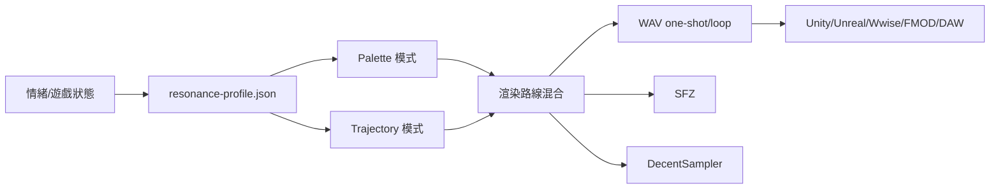

# 共振結構遊戲音效生成器開發需求與技術路線

本專案建議定位為**開源的情緒驅動音效渲染系統**：把「情緒／遊戲狀態」轉成一份可重建的 `resonance-profile.json`，再用多條渲染路線輸出成遊戲可用的 `WAV / SFZ / DecentSampler` 素材。第一階段不追求完整作曲，而是先把**小音效、UI、魔法 one-shot、短 cue、狀態過渡**做好；這比旋律生成更容易驗收，也更貼近遊戲實務。Web 端可依靠 Web Audio API 的 `PeriodicWave`、`AudioWorklet`、`OfflineAudioContext` 與 `AudioParam` 自動化來完成原型；遊戲整合概念上可對應 Wwise 的 RTPC、States、Switches、Random/Blend Containers。citeturn4view4turn4view1turn4view2turn4view3turn5view0turn19view0turn18view2turn19view1turn19view3

**目錄**  
- 執行摘要與目標受眾  
- 核心概念與開放格式  
- 特徵、情緒映射與兩種模式  
- 渲染路線與輸出策略  
- MVP、開源策略與示範  
- 風險、研究法與附表

## 執行摘要與目標受眾

目標受眾分三類：一是**獨立遊戲開發者與技術美術／音效設計師**，他們需要同世界觀下的大量按鈕音、互動音、狀態變化音；二是**聲音工具開發者**，可直接採用 open spec 與參考渲染器；三是**合成器／WebAudio／DSP 玩家**，可用它做研究與延伸。Web Audio API 本來就把遊戲與互動應用列為設計場景之一；Wwise 則把連續控制、全域狀態與離散切換分別交由 RTPC、State、Switch/Container 處理，剛好能對應本案的 Trajectory 與 Palette 思路。citeturn4view4turn19view0turn18view2turn19view1turn19view3

**下一步**
1. 在 README 首句固定定位：`Emotion-driven procedural SFX from resonance structures.`  
2. 明確標示第一版只做「遊戲 SFX／短 cue」，不做完整作曲。  
3. 建立三個 persona 使用情境：UI 設計、魔法音效、危險狀態過渡。

## 核心概念與開放格式

**概念定義**

| 名稱 | 簡短定義 |
|---|---|
| 共振結構 | 一組 partial 與它們之間的比例、衰退、脈動、相位關係 |
| `resonance-profile.json` | 可重建音色的開放描述檔，不綁任何 DAW |
| 渲染路線 | 同一份 profile 可走不同合成法，如 additive、modal、FM |
| 情緒→音色映射 | 把安全、危險、神聖、腐化等轉成可量化參數 |
| Palette 模式 | 產生一組離散但同族的小音效 |
| Trajectory 模式 | 讓音色在一段時間內連續變化 |

**格式草案重點**

| 欄位 | 必要 | 說明 |
|---|---:|---|
| `version` | 是 | 規格版本 |
| `mode` | 是 | `palette` 或 `trajectory` |
| `sampleRate` | 是 | 建議 48000 |
| `rootHz` | 是 | 參考頻率 |
| `partials[]` | 是 | 每個 partial 的頻率、增益、衰退等 |
| `renderMix` | 是 | 各渲染路線比例，總和 1 |
| `relations[]` | 否 | 5/7 系、拍頻、對齊或避讓資訊 |
| `emotionTags[]` | 否 | 例如 `sacred`, `danger`, `cute` |
| `keyframes[]` | Trajectory 必要 | 連續變化控制點 |
| `exportHints` | 否 | one-shot / loop / length / tail |

```json
{
  "version": "0.1",
  "mode": "trajectory",
  "sampleRate": 48000,
  "rootHz": 151.2,
  "partials": [
    {"id":"P1","freqHz":151.2,"gainDb":-6,"decaySec":1.8,"pulseHz":0.0,"pulseDepth":0.0,"phase":0.0},
    {"id":"P2","freqHz":302.4,"gainDb":-12,"decaySec":2.6,"pulseHz":0.35,"pulseDepth":0.12,"phase":0.8}
  ],
  "relations": [
    {"a":"P1","b":"P2","ratio":"2:1","errorCents":3,"role":"anchor"}
  ],
  "renderMix": {"additive":0.5,"modal":0.3,"fm":0.1,"granular":0.0,"sampleBased":0.1},
  "emotionTags": ["suspicion","fear"],
  "keyframes": [
    {"time":0.0,"brightness":0.30,"dissonance":0.25,"breathiness":0.10},
    {"time":5.0,"brightness":0.62,"dissonance":0.78,"breathiness":0.35}
  ]
}
```

SFZ 適合當文字化 sampler 輸出，因為它本身就是純文字、以 `<region>/<group>/<global>` 和 opcode 描述 sample 對應與調變；DecentSampler 也用 XML `dspreset` 描述樣本、群組、效果與調變。citeturn13view0turn7view0turn8view0turn6view0

**下一步**
1. 先凍結 `version / mode / rootHz / partials / renderMix` 五個最小欄位。  
2. 製作 JSON Schema 與 3 份有效範例。  
3. 定義向下相容規則：未知欄位可忽略。

## 特徵、情緒映射與兩種模式

**音色特徵清單**

| 特徵 | 建議範圍 / 單位 | 主觀感覺 |
|---|---|---|
| `freqHz` | 20–20000 Hz | 音高位置、亮度基礎 |
| `gainDb` | -60–0 dB | 強弱、是否突出 |
| `decaySec` | 0.01–30 s | 短促、空靈、餘韻 |
| `pulseHz` | 0–20 Hz | 呼吸、顫動、緊張 |
| `pulseDepth` | 0–1 | 呼吸感強度 |
| `phase` | 0–2π | 聚焦、散開、毛邊 |
| `errorCents` | -50–50 cent | 穩定、粗糙、失真 |
| `relationStrength` | 0–1 | 同族感、結構感 |
| `brightness` | 0–1 | 清亮、陰暗 |
| `dissonance` | 0–1 | 和諧、不安 |
| `breathiness` | 0–1 | 空氣感、霧感 |
| `metallicity` | 0–1 | 金屬、玻璃、鐘感 |
| `renderMix.*` | 0–1 | 各合成法比例 |

**情緒映射表**

| 情緒 / 狀態 | 變化建議 |
|---|---|
| 安全 | `dissonance↓ phaseScatter↓ noise↓ lowAnchor↑` |
| 危險 | `brightness↑ dissonance↑ pulseDesync↑` |
| 神聖 | `decay↑ 5-limit對齊↑ 高頻乾淨↑` |
| 腐化 | `errorCents↑ noise↑ phaseScatter↑` |
| 稀有 | `attack清楚 sparkle↑ tail乾淨↑` |
| 可愛 | `decay短 pulse小 simpleRatio↑` |
| 興奮 | `attack↑ pulseHz↑ brightness↑` |
| 恐懼 | `lowAnchor↓ 7-limit↑ breathiness↑` |

`Palette` 適合 UI click、confirm、rare drop 這種**離散素材**；`Trajectory` 適合「懷疑→恐懼」「安全→危險」這種**連續過渡**。在遊戲中，前者近似 Wwise 的 Switch / Random / Blend 組合；後者近似 RTPC 曲線，而全域場景切換則更像 State。citeturn19view0turn18view2turn19view1turn19view3

```json
{
  "cue": "suspicion_to_fear",
  "keyframes": [
    {"time":0.0,"dissonance":0.25,"brightness":0.30,"pulseDesync":0.15},
    {"time":2.5,"dissonance":0.50,"brightness":0.45,"pulseDesync":0.40},
    {"time":5.0,"dissonance":0.78,"brightness":0.62,"pulseDesync":0.75}
  ]
}
```

**下一步**
1. 先定 8 個情緒標籤，避免第一版標籤爆炸。  
2. 為每個標籤做 3 個實聽範例，人工校正參數。  
3. 先用手工 keyframe，不要先做自動情緒推理。

## 渲染路線與輸出策略

Web 版參考渲染器建議用 Web Audio API：加法／基本波形可用 `PeriodicWave`，客製 DSP 用 `AudioWorklet`，離線匯出用 `OfflineAudioContext`，而 Trajectory 可直接用 `AudioParam` 的 ramp 與 automation。citeturn4view3turn4view2turn4view1turn5view0turn5view3

| 路線 | 優點 | 限制 | 適用場景 | 建議輸出參數 |
|---|---|---|---|---|
| Additive | 可精準對齊 partial | 聲音容易太乾淨 | 頌缽、鐘、UI chime | 8–64 partial |
| Modal | 很像共振物體 | 參數較抽象 | 金屬、木板、空間物件 | 4–24 modes |
| FM | 複雜、金屬、玻璃感強 | 調太深易刺耳 | 魔法、科技、警示 | 2–6 operators |
| Granular | 霧感、流動、碎裂 | 容易失焦 | 腐化、夢境、環境尾巴 | 10–80 ms grains |
| Sample-based | 最容易落地與整合 | 可塑性較低 | 量產素材包 | 3–12 layers |

FM 的經典優勢是用少量控制做出複雜頻譜；粒狀法是用大量極短 grains 組成聲音；模態法適合有明顯共振模態的物體。citeturn11search1turn12search4turn9search6

**輸出格式建議順序**：`WAV` 為第一優先；`resonance-profile.json` 保留可重建能力；第二步輸出 `SFZ`；第三步輸出 `DecentSampler dspreset`。DecentSampler 官方格式是文字檔加樣本檔，且播放器本身可作為 VST/VST3/AU/AAX/Standalone/iOS 使用，適合當跨 DAW 的早期承載。citeturn16search9turn13view0turn7view0turn8view0turn1search0



**下一步**
1. 先實作 additive + modal 兩條路線。  
2. 輸出只做 WAV + JSON；SFZ/DS 放第二階段。  
3. 每條路線先固定 3 個預設模板。

## MVP、開源策略與示範

**MVP 任務清單**

| 任務 | 優先 | 工作量 | 驗收標準 |
|---|---|---:|---|
| Web demo 上傳/播放 | 高 | 中 | 可載入檔案、展示 profile、可試聽 |
| Reference renderer | 高 | 中 | additive/modal 可穩定輸出 |
| WAV export | 高 | 低 | 可下載 48k/24-bit one-shot |
| JSON preset | 高 | 低 | 可存可讀、版本正確 |
| 情緒面板 | 中 | 中 | 8 標籤可改聲音且有差異 |
| SFZ export | 中 | 中 | 可被 SFZ 播放器讀入 |
| 範例包 | 高 | 低 | 至少 5 組 demo 可直接下載 |
| README 範本 | 高 | 低 | 3 分鐘能懂專案用途 |

**開放與保留**  
建議 `MIT`；若特別在意專利聲明可考慮 `Apache-2.0`。開源內容：格式規格、分析器、參考渲染器、匯出器、範例 preset、web demo。保留內容：正式品牌、精選音色包、展示網站素材。社群策略不是追求大眾爆紅，而是做出**一聽就懂**的 demo：`Sacred Click Set`、`Corrupted UI Set`、`Rare Drop Chimes`、`Suspicion→Fear Cue`、`Temple Mechanism Pack`。Wwise 的 Random/Sequence/Switch/Blend 與 RTPC/State 文件也說明了遊戲聲音最常見的就是隨機變體、離散替換與連續控制，正好可作為宣傳語言。citeturn19view3turn19view0turn18view2

**下一步**
1. GitHub repo 先上 `spec + demo + 5 個音檔`。  
2. README 第一屏放 15 秒 gif 與 3 個下載按鈕。  
3. 發布時主打「遊戲 SFX 不用寫旋律，也能有情緒」。

## 風險、研究法與附表

**技術風險與研究方法**

| 風險 | 問題 | 建議方法 |
|---|---|---|
| peak 偵測不穩 | 弱峰被漏掉、雜訊誤判 | 先用 STFT + `find_peaks`，再用 `piptrack` 補頻率；做 20 份人工標註集比對 citeturn18view4turn18view5 |
| partial 對齊演算法 | 5/7 系對齊易過度擬合 | 先只做 `2/3/5/7` 四類；用 cents 誤差門檻與人工聽測雙驗證 |
| Trajectory 斷裂 | 參數跳變造成爆音 | 僅允許 ramp / setTarget；關鍵參數最短過渡 20–50ms citeturn5view3 |
| 跨 DAW 相容 | 插件成本高 | 先走 WAV / SFZ / DecentSampler，不先做 VST |
| 情緒標籤漂移 | 同一標籤風格不穩 | 每個標籤做參數中心與容差，不自由漂移 |

**附表**

| 文件目錄結構 | 說明 |
|---|---|
| `/spec/resonance-profile.schema.json` | 規格 |
| `/packages/analyzer` | 頻譜與 peak 分析 |
| `/packages/renderer-web` | WebAudio renderer |
| `/packages/exporters` | wav / sfz / decent-sampler |
| `/examples` | JSON、音檔與螢幕錄影 |
| `/docs/README.md` | 專案入口 |

| API / CLI 範例 | 用途 |
|---|---|
| `resonance analyze in.wav -o profile.json` | 由音檔抽 profile |
| `resonance render profile.json -o out.wav --mix additive=0.6,modal=0.4` | 渲染 WAV |
| `resonance export-sfz profile.json -d ./sfz-pack` | 匯出 SFZ |
| `POST /api/render` + JSON body | Web demo 渲染 |
| `POST /api/palette` + emotion tags | 產生一組 UI/SFX |

| Demo 檔名 | 用途 |
|---|---|
| `sacred_click_palette` | 神聖風 UI 點擊組 |
| `corrupted_ui_set` | 腐化世界觀按鈕組 |
| `rare_drop_chime` | 稀有掉落提示 |
| `suspicion_to_fear_cue` | Trajectory 過渡示範 |
| `temple_mechanism_pack` | 神殿機關互動音集合 |

**建議優先查閱來源類型**：W3C Web Audio API、SFZ 規格文件、DecentSampler Developer Guide、Audiokinetic Wwise RTPC/State/Switch 文件、SciPy / librosa 文件、Chowning FM 論文、DAFx 粒狀與模態相關論文。citeturn3search0turn13view0turn6view0turn19view0turn18view2turn19view1turn18view4turn18view5turn11search1turn12search4turn9search6

**下一步**
1. 先做 20 個手工標註 profile 當測試集。  
2. 訂出 `v0.1 spec` 與 `MVP done` 驗收清單。  
3. 每週固定做一次 A/B 聽測，優先修「可感知差異」最大的問題。
